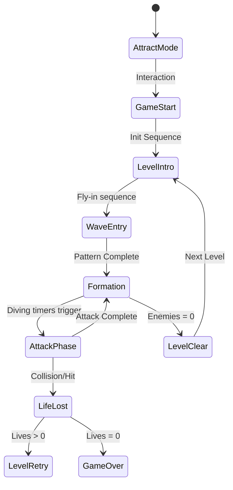

# Galaga 技術規格書：01_系統架構與狀態機 (System Architecture & State Machine)

## 1. 核心技術棧與模組分工 (Technology Stack & Architecture)
本專案採用現代 Web 遊戲開發架構，取代傳統硬體模擬。核心由以下引擎驅動：

| 模組名稱 | 採用技術 | 職責描述 |
| :--- | :--- | :--- |
| **渲染引擎 (Visual)** | **PixiJS (WebGL)** | 負責所有幾何形狀、霓虹發光特效、背景 3D 網格及粒子系統的高效渲染。 |
| **物理引擎 (Physics)** | **Matter.js** | 處理多邊形碰撞偵測、運動量性 (Inertia)、阻力 (Friction) 及爆炸衝力計算。 |
| **音訊引擎 (Audio)** | **Web Audio API** | 實現合成器音效 (Synth SFX) 與背景音樂的非同步回放與頻率調控。 |

### 1.1 渲染與性能規範
- **渲染基底**: WebGL 2.0 (透過 PixiJS 封裝)。
- **目標幀率**: 恆定 60 FPS (使用 `requestAnimationFrame`)。
- **解析度**: 基礎畫布為 **960×720**，響應式佈局 (Responsive)，最高支援 4K 縮放而不失真（向量繪製優勢）。

---

## 2. 核心狀態機模型 (Main State Machine)

### 2.1 遊戲全域狀態 (Global States)

### 2.2 敵機單體 AI 狀態 (Enemy Entity States)
1.  **Entry (進場)**: 遵循向量路徑進入畫面，此時 Matter.js 碰撞判定設為感應器 (Sensor) 模式。
2.  **Formation (編隊)**: 在頂部歸位並進行正弦波位移 (Sinusoidal Movement)。
3.  **Dive (俯衝)**: 啟動 Matter.js 剛體動力學，脫離編隊展開動態攻擊。
4.  **Fever (狂熱狀態)**: 當 Heat Gauge 滿值時，所有敵機改變渲染 Texture (更換為 Neon-Pink) 並增加速度倍率。
5.  **Splitting (合體)**: 特殊狀態判定，處理多個幾何體的物理合併邏輯。

---

## 3. 碰撞與物理邏輯 (Physics & Collision)
利用 Matter.js 的標籤 (Label) 系統優化碰撞處理：
1.  **Label: PlayerBullet vs. Enemy**: 觸發形狀碎裂粒子特效 (Shard Particles)。
2.  **Label: EnemyBullet vs. Player**: 執行扣血與螢幕震動 (Screen Shake)。
3.  **Label: Bomb vs. All**: 爆炸層級判定，清除半徑內的所有 `Enemy` 標籤物件。

---
> 🎮 **Programmer Note**: PixiJS 的 `shapesLayer` 與 Matter.js 的 `engine.world` 需保持嚴格的座標同步。建議在 `gameLoop` 中執行物理 Sub-stepping 以確保在高速移動下的碰撞精確度。
