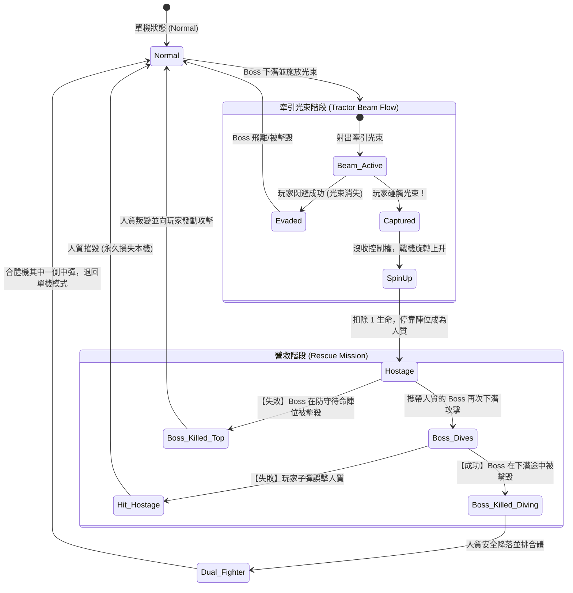

## 6. 內容設計 (Content Design)

### 6.1 敵人型態 (Enemy Types)
遊戲中的敵人分為三階，行為模式與得分皆不同。所有敵人出場皆以「非同步曲線路徑」飛入畫面，而非直接在上方刷新。

#### Boss Galaga (大首領)
*   **外觀**: 發出螢光綠色 (Neon Green) 泛光的「雙層同心六邊形 (Hexagon)」線框體。
*   **行為**: 必定位於編隊最頂端（共 4 隻）。俯衝時通常會帶領 2 隻紅色護衛。具備施放「牽引光束」的能力。血量為 2（第一擊變色，第二擊墜毀）。
*   **設計要求**: 當只剩牠存活時，攻擊頻率與速度將狂暴化。

#### Guard / Butterfly (紅蝴蝶)
*   **外觀**: 發出紫紅色 (Magenta) 泛光的「雙層同心菱形 (Diamond)」線框體。
*   **行為**: 位於編隊中層（共 16 隻）。俯衝路徑呈現不規則的「S」型弧線，最難以預測。

#### Grunt / Bee (藍黃蜜蜂)
*   **外觀**: 發出螢光黃色 (Neon Yellow) 泛光的「雙層同心正三角形 (Triangle)」線框體。
*   **行為**: 位於編隊底層（共 20 隻）。俯衝多為直線或拋物線，負責填補子彈網與封鎖玩家走位。

### 6.2 敵軍進場模式 (Enemy Spawn Patterns)
如同經典版（參考影片 0:30 起的第二關開場），敵軍在每關開始時並不會直接出現在畫面上方，而是以「飛行進場」的方式逐步填滿陣型。

*   **進場波次 (Waves)**: 每一關包含 5 個獨立的進場波次，每波由 8 隻敵機組成，總計 40 隻最終會組合出完整的陣型 (Boss 4 隻, Butterfly 16 隻, Bee 20 隻)。
*   **動態軌跡 (Dynamic Trajectories)**:
    - **底端飛入 (Bottom Entry)**: 作為每局第一波開場，一列敵機由畫面左下或右下方魚貫飛入，向中央高空爬升進行一次 360 度大迴旋後，往兩側散開並飛向指定的上方網格陣位。
    - **頂端飛入 (Top Entry)**: 後續波次會由左上或右上方切入畫面，向中央下方進行大幅度 U 型俯衝後，再拉升至頂部就緒。
*   **進場威脅與獎勵 (Entry Threat & Reward)**: 
    - 敵機在飛入場中排隊的過程中**會對玩家開火**並具備致命的碰撞判定。
    - 玩家若在敵機抵達最終陣位「前」將其擊落，可獲得等同於「攻擊中」的 2 倍高分獎勵（與待命陣位相比）。這項設計鼓勵玩家預判軌跡主動攔截，降低成陣後的壓迫感。

### 6.3 挑戰關卡 (Challenging Stages)
*   **頻率**: 第 3 關、第 7 關、第 11 關，之後每隔 3 關一次。
*   **配置**: 40 隻敵人在背景星空變成藍色的情況下，不斷切變複雜幾何軌跡飛過（不開火）。
*   **評級**:
    *   擊落 39 以下：每隻 100 分。
    *   全滅 40 隻：額外獲得 10,000 分 (Perfect Bonus)。

### 6.4 雙機合體與牽引光束機制 (Tractor Beam & Dual Fighter)
經典的「牽引光束」與「雙機合體」是遊戲的核心高風險高回報機制（參考影片 02:18 起）。透過蓄意犧牲一架戰機來換取後期的雙倍火力，是突破高難度關卡的關鍵戰術，在此一併設計其狀態機邏輯以供工程實作。

#### 1. 機制運作流程描述
1.  **光束釋放 (Tractor Beam Emit)**: 當 Boss Galaga 進行俯衝攻擊時，有一定機率會在畫面中央偏下的位置停滯，並向下釋放圓錐狀的牽引光束網（在本作中以高亮度青藍色泛光呈現）。**注意：若玩家當前處於雙機合體 (Dual Fighter) 狀態，Boss 將不會觸發牽引光束**——因為此時沒有可俘獲的目標，且玩家已付出過一次犧牲。
2.  **捕獲過程 (Capture Process)**: 若玩家戰機觸碰到牽引光束，控制權將立即喪失。戰機會開始原地打轉，並逐漸被吸收到 Boss 的頂端陣位。此時玩家首度**失去一條備用生命**（若無剩餘生命，照常 Game Over）。
3.  **人質待命 (Hostage State)**: 被捕獲的戰機會變成紅色，停留在該 Boss 的旁邊作為人質。
4.  **營救判斷 (Rescue Mission)**:
    *   **成功營救**: 當該帶有「人質」的 Boss 再次發起俯衝時，玩家若在**其下潛的過程中**精準擊落 Boss，人質戰機會一邊旋轉一邊緩緩降落，並與玩家當前戰機並排停靠，完成「雙機合體 (Dual Fighter)」，此後便能發射雙倍火力。
    *   **誤殺判定 (失敗)**:
        *   若玩家誤擊中「人質戰機」，則該戰機會當場爆炸損毀（玩家獲得 1,000 分，但永久無法回收戰機）。
        *   若玩家在 Boss **停留在頂端網格待命陣位時**將其提早擊殺，人質戰機將會**叛變**成為具有高度威脅性的敵機對玩家發動俯衝攻擊（必須將其擊落以自保，同樣獲得 1,000 分並永久失去本機）。
5.  **合體機中彈**: 雙機狀態下的碰撞判定體積將擴大至兩倍寬。若其中一側遭到敵軍撞擊或被敵方子彈命中，僅有該側的戰機損毀，玩家將退回「單機模式」繼續作戰。**退回瞬間給予 1.5 秒無敵時間**，並播放爆炸與螢幕震動反饋以提示狀態變更。此設計避免玩家在失去雙機的瞬間因連續受擊而額外扣命。

#### 3. 雙機合體的動態平衡調整 (Dual Fighter Counterbalance)
為維持「高風險高回報」的核心設計精神，雙機合體啟用後，敵方 AI 將相應強化以平衡雙倍火力帶來的優勢。

*   **Boss 散射強化 (Boss Spread Fire)**: 當玩家處於雙機合體狀態時，Boss Galaga 的俯衝射擊將從單發子彈升級為**三發扇形散射 (Three-Way Spread)**，散射角度約為 ±14°。此舉大幅壓縮玩家的安全走位空間，抵消雙機狀態帶來的進攻優勢。
*   **牽引光束封印 (Beam Suppression)**: 如上第 1 點所述，雙機狀態下 Boss 不會釋放牽引光束。
*   **得分倍率 (Score Multiplier)**: 雙機合體狀態下的所有擊殺得分乘以 **×1.5**，獎勵承擔風險的玩家。
*   **Rank 加成 (Rank Bonus)**: 成功完成合體時，Rank 值增加 **+10**，加速整體難度攀升以回饋與懲罰並行。

#### 2. 狀態機流程圖 (Mermaid)
為了確保上述行為邏輯不會出現 Race Condition 的漏洞，請程式團隊在實作物件時參照以下狀態機 (State Machine) 架構圖：

