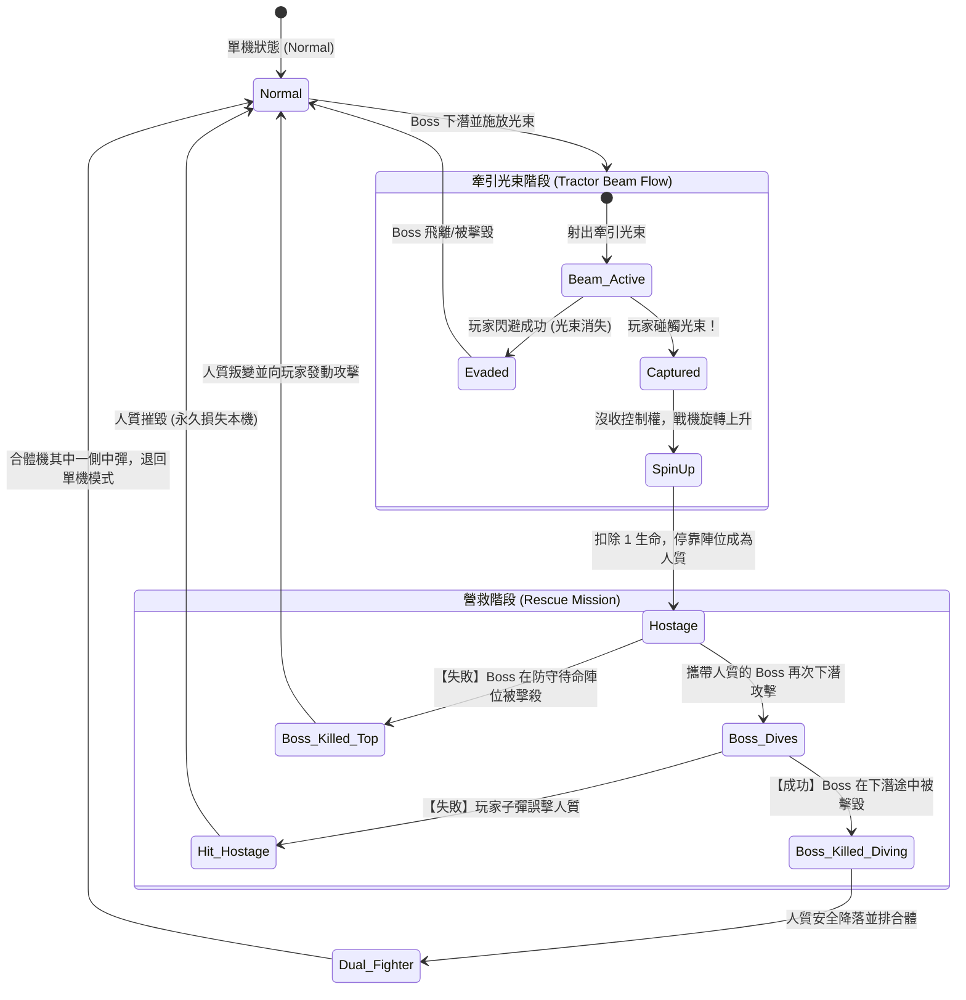

# Galaga H5 Mobile
*The Classic Arcade Shooter, Reimagined for the Web*

**Genre**: Fixed Screen Space Shooter  
**Platform**: HTML5 (Mobile Web / PWA)  
**Target Audience**: Casual to Midcore Gamers, Arcade Nostalgics  
**Version**: 1.0  
**Date**: 2026-03-27  
**Developer**: Antigravity Studio  

**CONFIDENTIAL — For internal use and authorized partners only. Do not distribute without written permission.**

---

## 1. 執行摘要 (Executive Summary)

### Elevator Pitch
《大蜜蜂》(Galaga) 是一款重新定義 1980 年代街機黃金時代的**固定畫面射擊遊戲 (Fixed Shooter)**，現在以 HTML5 技術與手機直式 (Portrait) 操作介面全面重製。玩家將透過流暢的觸控拖曳與自動連發，享受最純粹的太空格鬥體驗。

### Unique Value Proposition (獨特價值主張)
*   **完美觸控適配 (Touch-First Design)**：以相對觸控 (Relative Touch) 與自動連發 (Auto-Fire) 取代傳統搖桿，單手即可享受彈幕躲避的快感。
*   **雙機合體 (Dual Fighter)**：保留最經典的高風險高回報機制，故意被俘虜後救回戰機，獲得雙倍橫向火力。
*   **隨點即玩 (Instant Play)**：無須下載、無須投幣，透過 H5 技術在任何手機瀏覽器上達到 60 FPS 的流暢體驗。

### 核心市場定位 (Market Constraints)
| 特性 | 設定 |
|---|---|
| Genre | 街機射擊 (Arcade Shooter) |
| Platform | H5 (Mobile Web / PWA) |
| Audience | 全年齡層、碎片化時間玩家、復古愛好者 |
| Monetization | 免費遊玩 (F2P) / 廣告變現 |
| Team | 小型開發團隊 (2-3人) |

---

## 2. 遊戲概觀 (Game Overview)

### High Concept Statement
單手操控一台深空戰機，在無盡的蟲怪編隊與俯衝攻擊中，透過雙機合體的強大火力爭取最高的分數榮耀。

### Core Fantasy
讓你隨時隨地，只要打開手機網頁，就能瞬間體驗當年稱霸街機廳的專注力與彈幕躲避極限。

### Experience Pillars
1. **彈指間的微操 (Precision at Your Fingertips)**：將笨重的街機搖桿轉化為 1:1 精準的手指跟隨，讓閃躲毫釐之間的子彈成為本能。
2. **高風險的火力投資 (High-Risk Investment)**：為了雙倍火力，玩家必須經歷短暫失去戰鬥力並冒著誤殺友軍的風險，這是一種極度刺激的心跳體驗。
3. **無縫接軌的心流 (Frictionless Flow)**：沒有繁瑣的升級選單或體力限制，死掉後一鍵重啟，最大化「再來一局 (One more run)」的誘惑。

### Session Flow
```text
開啟網頁 -> 點擊開始 (即時進入第一關) -> 清理編隊 -> 遭遇首領牽引光束 -> 合體雙機 -> 挑戰關卡 (純加分) -> 死亡 -> 結算上傳排行榜 -> 再次遊玩
```

### 比較分析 (Comparable Titles)
*   "We are **Galaga (1981)**, but with **現代 H5 手機直控的極致流暢度與響應式排版**。"

---

## 3. 核心遊戲循環 (Core Gameplay Loop)

### 3.1 核心微循環 (Micro Loop: 1-2 分鐘)
玩家的核心行為專注於躲避與射擊單波敵人的俯衝。
```text
[DIAGRAM: Core Micro Loop]
敵人編隊飛入畫面上方(不攻擊) → 玩家掃射以獲取低分 → 敵人就位 → 敵人隨機發動俯衝攻擊與彈幕 → 玩家觸控迴避並擊落(獲取高分) → 清空全部敵人 → 進入下一關
```

### 3.2 宏觀循環 (Macro Loop: 5-10 分鐘)
管理有限的生命數與火力狀態，撐過挑戰關卡。
```text
[DIAGRAM: Macro Loop]
維持單機狀態 → 遭遇大首領(Boss Galaga)發射牽引光束 → 刻意被抓(犧牲一條命) → 用備用戰機擊落帶有俘虜的首領 → 成功合體(火力&碰撞體積x2) → 以雙倍火力迎戰 Challenge Stage 拿全滅 10000 分。
```

### 3.3 元循環 (Meta Loop: 長期留存)
雖然遊戲沒有數值成長，但元循環建立在排行榜與技術磨練上。
```text
[DIAGRAM: Meta Loop]
遊玩累積總分 → 達到 20,000 / 70,000 分獲得額外生命加成 → 延長單局時間與存活率 → 創造新的高分 (High Score) → 上傳至全球 H5 排行榜 → 被他人超越後刺激再次挑戰。
```

---

## 4. 遊戲機制 (Game Mechanics)

### 4.1 手機觸控移動系統 (Mobile Touch Movement)
為適應手機直式螢幕，移動系統需要根本上的改變。
*   **Input**: 玩家在螢幕下半部任意區域進行水平橫向滑動 (Swipe / Drag)。
*   **System**: 採用**相對位移 (Relative Mapping)**。戰機不是跟隨手指的絕對座標，而是跟隨手指滑動的增量。戰機被限制在螢幕寬度的安全區內，無法超出邊界；Y 軸高度固定於螢幕底端上方 15% 處。
*   **Feedback**: 手指觸壓時產生微小的粒子視覺反饋，戰機噴射尾焰會根據移動方向稍微傾斜。
*   **Parameters**:
    | Parameter | Value | Range | Notes |
    |---|---|---|---|
    | 靈敏度 (Sensitivity) | 1.2x | 0.8x - 2.0x | 手指移動 1cm，戰機移動 1.2cm |
    | 邊界限制 (Bounds) | X: 10%~90% | - | 避免戰機超出視覺死角 |
*   **Rationale**: 傳統的虛擬搖桿會遮擋視線且缺乏精準度；相對觸控讓玩家可以在螢幕最底端操作，不遮住上方敵人的視線，這是現代彈幕手遊的黃金標準 [Assumption: 基於現代 STG 手遊設計慣例]。

### 4.2 自動連發射擊 (Auto-Fire)
*   **Input**: 只要手指按住螢幕，就會自動連續開火。
*   **System**: 畫面上最多允許同時存在 2 發玩家子彈 (雙機時為 4 發)。子彈以固定速度直線向上飛。
*   **Feedback**: 復古電子合成音 `Pew-Pew`。
*   **Parameters**:
    | Parameter | Value | Range | Notes |
    |---|---|---|---|
    | 發射冷卻 (Cooldown) | 0.15s | 0.1s - 0.2s | 最快擊發間隔 |
    | 子彈速度 (Velocity) | 600 px/s | 500-800 | [PLAYTEST: 需根據手機螢幕比例與高寬比調整] |
*   **Rationale**: 手機不適合同時控制搖桿與點擊按鍵，「按住自動射擊」可消除肌肉疲勞，符合街機最初期望的「舒壓」理念。

### 4.3 雙機合體系統 (Dual Fighter)
*   **Input**: 刻意移動至 Boss 發射的藍色牽引光束中停駐。救援時要求精準射擊 Boss 本體。
*   **System**:
    - 光束判定：停留 2.1 秒即觸發俘虜判定。
    - 戰機被扣押於編隊頂端。
    - 若在首領執行「俯衝攻擊」時擊落它（需 2 擊），俘虜戰機將回歸玩家身旁。
    - 若打中俘虜戰機，則該戰機被摧毀（損失一條命）。
*   **Feedback**: 戰機被光束罩住時會旋轉，並伴隨防空警報音效。成功合體會播放激昂的專屬旋律，畫面出現兩台併排戰機。
*   **Parameters**:
    | Parameter | Value | Range | Notes |
    |---|---|---|---|
    | 火力倍率 | 2x | 2x | 兩機同時出發 |
    | Hitbox 寬度 | 1.8x | 1.5x - 2.0x | 大幅增加被彈風險 |
*   **Rationale**: 核心風險/回報機制。迫使玩家在高難度關卡主動出擊，體驗獨特的心跳時刻。

---

## 5. 進程與難度系統 (Progression System)

由於沒有裝備或等級概念，遊戲進程以「關卡難度疊加」與「額外生命獎勵」來體現。

### 5.1 難度縮放公式 (Difficulty Scaling)
每一關 (Stage) 都會增加敵機的活動量與子彈網密度。
*   **敵方子彈基礎速度**: `(Base: 300 px/s) + (Stage * 15 px/s)`
*   **同時俯衝最大敵人數**: `Min(3 + Stage/2, 8)`
*   **敵方俯衝速度**: 第 1-4 關正常，第 5 關後開始出現快速迴旋，第 10 關達到速度上限。

### 5.2 額外生命系統 (Extra Lives/Extend)
為鼓勵玩家追求高分與技術，採取經典分數換命制。
*   **初始生命**: 3 命
*   **第一次 Extend**: 20,000 分
*   **第二次 Extend**: 70,000 分
*   **後續 Extend**: 每 70,000 分額外獎勵一命。
*   **UI表現**: 達到目標分數時，螢幕閃爍 "1 UP"，並伴隨升級音效。此機制是維繫 F2P 玩家單局時間的重要元循環。

### 5.3 得分系統表 (Scoring Table)
| 敵人/事件 | 類型 | 得分 | 觸發條件 |
|---|---|---|---|
| Grunt / Bee | 編隊中 | 50 | 停留在上方陣型時擊毀 |
| Grunt / Bee | 攻擊中 | 100 | 俯衝狀態中擊毀 |
| Guard / Butterfly | 編隊中 | 80 | 停留在上方陣型時擊毀 |
| Guard / Butterfly | 攻擊中 | 160 | 俯衝狀態中擊毀 |
| Boss Galaga | 編隊中 | 150 | 停留在上方陣型時擊毀 |
| Boss Galaga | 攻擊中 | 400 | 單獨俯衝時擊毀 |
| Boss Galaga | 攻擊中 | 800 | 帶領一隻護衛俯衝時擊毀 |
| Boss Galaga | 攻擊中 | 1600 | 帶領兩隻護衛俯衝時擊毀 |

---

## 6. 內容設計 (Content Design)

### 6.1 敵人型態 (Enemy Types)
遊戲中的敵人分為三階，行為模式與得分皆不同。所有敵人出場皆以「非同步曲線路徑」飛入畫面，而非直接在上方刷新。

#### Boss Galaga (大首領)
*   **外觀**: 發出螢光綠色 (Neon Green) 泛光的「雙層同心六邊形 (Hexagon)」線框體。
*   **行為**: 必定位於編隊最頂端（共 4 隻）。俯衝時通常會帶領 2 隻紅色護衛。具備施放「牽引光束」的能力。血量為 2（第一擊變色，第二擊墜毀）。
*   **設計要求**: 當只剩牠存活時，攻擊頻率與速度將狂暴化。

#### Guard / Butterfly (紅蝴蝶)
*   **外觀**: 發出紫紅色 (Magenta) 泛光的「雙層同心菱形 (Diamond)」線框體。
*   **行為**: 位於編隊中層（共 16 隻）。俯衝路徑呈現不規則的「S」型弧線，最難以預測。

#### Grunt / Bee (藍黃蜜蜂)
*   **外觀**: 發出螢光黃色 (Neon Yellow) 泛光的「雙層同心正三角形 (Triangle)」線框體。
*   **行為**: 位於編隊底層（共 20 隻）。俯衝多為直線或拋物線，負責填補子彈網與封鎖玩家走位。

### 6.2 敵軍進場模式 (Enemy Spawn Patterns)
如同經典版（參考影片 0:30 起的第二關開場），敵軍在每關開始時並不會直接出現在畫面上方，而是以「飛行進場」的方式逐步填滿陣型。

*   **進場波次 (Waves)**: 每一關包含 5 個獨立的進場波次，每波由 8 隻敵機組成，總計 40 隻最終會組合出完整的陣型 (Boss 4 隻, Butterfly 16 隻, Bee 20 隻)。
*   **動態軌跡 (Dynamic Trajectories)**:
    - **底端飛入 (Bottom Entry)**: 作為每局第一波開場，一列敵機由畫面左下或右下方魚貫飛入，向中央高空爬升進行一次 360 度大迴旋後，往兩側散開並飛向指定的上方網格陣位。
    - **頂端飛入 (Top Entry)**: 後續波次會由左上或右上方切入畫面，向中央下方進行大幅度 U 型俯衝後，再拉升至頂部就緒。
*   **進場威脅與獎勵 (Entry Threat & Reward)**: 
    - 敵機在飛入場中排隊的過程中**會對玩家開火**並具備致命的碰撞判定。
    - 玩家若在敵機抵達最終陣位「前」將其擊落，可獲得等同於「攻擊中」的 2 倍高分獎勵（與待命陣位相比）。這項設計鼓勵玩家預判軌跡主動攔截，降低成陣後的壓迫感。

### 6.3 挑戰關卡 (Challenging Stages)
*   **頻率**: 第 3 關、第 7 關、第 11 關，之後每隔 3 關一次。
*   **配置**: 40 隻敵人在背景星空變成藍色的情況下，不斷切變複雜幾何軌跡飛過（不開火）。
*   **評級**:
    *   擊落 39 以下：每隻 100 分。
    *   全滅 40 隻：額外獲得 10,000 分 (Perfect Bonus)。

### 6.4 雙機合體與牽引光束機制 (Tractor Beam & Dual Fighter)
經典的「牽引光束」與「雙機合體」是遊戲的核心高風險高回報機制（參考影片 02:18 起）。透過蓄意犧牲一架戰機來換取後期的雙倍火力，是突破高難度關卡的關鍵戰術，在此一併設計其狀態機邏輯以供工程實作。

#### 1. 機制運作流程描述
1.  **光束釋放 (Tractor Beam Emit)**: 當 Boss Galaga 進行俯衝攻擊時，有一定機率會在畫面中央偏下的位置停滯，並向下釋放圓錐狀的牽引光束網（在本作中以高亮度青藍色泛光呈現）。
2.  **捕獲過程 (Capture Process)**: 若玩家戰機觸碰到牽引光束，控制權將立即喪失。戰機會開始原地打轉，並逐漸被吸收到 Boss 的頂端陣位。此時玩家首度**失去一條備用生命**（若無剩餘生命，照常 Game Over）。
3.  **人質待命 (Hostage State)**: 被捕獲的戰機會變成紅色，停留在該 Boss 的旁邊作為人質。
4.  **營救判斷 (Rescue Mission)**:
    *   **成功營救**: 當該帶有「人質」的 Boss 再次發起俯衝時，玩家若在**其下潛的過程中**精準擊落 Boss，人質戰機會一邊旋轉一邊緩緩降落，並與玩家當前戰機並排停靠，完成「雙機合體 (Dual Fighter)」，此後便能發射雙倍火力。
    *   **誤殺判定 (失敗)**:
        *   若玩家誤擊中「人質戰機」，則該戰機會當場爆炸損毀（玩家獲得 1,000 分，但永久無法回收戰機）。
        *   若玩家在 Boss **停留在頂端網格待命陣位時**將其提早擊殺，人質戰機將會**叛變**成為具有高度威脅性的敵機對玩家發動俯衝攻擊（必須將其擊落以自保，同樣獲得 1,000 分並永久失去本機）。
5.  **合體機中彈**: 雙機狀態下的碰撞判定體積將擴大至兩倍寬。若其中一側遭到敵軍撞擊或被敵方子彈命中，僅有該側的戰機損毀，玩家將退回「單機模式」繼續作戰。

#### 2. 狀態機流程圖 (Mermaid)
為了確保上述行為邏輯不會出現 Race Condition 的漏洞，請程式團隊在實作物件時參照以下狀態機 (State Machine) 架構圖：



---

## 7. 敘事與世界觀 (Narrative & World)

*   **世界觀 (Setting)**: 23世紀，人類的深空探測器進入了名為 "Galaga" 的星區，驚醒了具備高度集體意識的機械昆蟲型太空艦隊。
*   **核心動機**: 作為銀河防衛隊的最後一台戰機，玩家沒有退路，只能在一波又一波的蟲群中死守防線。
*   **敘事手法**: 本遊戲為純街機向，**無劇情文字、無過場動畫**。世界觀僅透過環境美術（如背景星星流動暗示正在超光速後退）與敵機的仿生昆蟲設計來隱性表達。
*   **風格理念**: "Keep it simple, keep it action." (保持簡單，專注動作)。

---

## 8. 使用者體驗與介面 (UX & UI)

完全針對手機直式 (Portrait 9:16) 進行排版與最佳化。

### 8.1 畫面佈局 (HUD Layout)
為了完美重現街機的視覺排列，同時適配手機直式 (Portrait 9:16) 視角，我們保留了經典街機螢幕的資訊佈局分區。

*   **頂部儀表板 (Top Dashboard)**:
    - **左上區域 (Top-Left)**: 標題顯示紅色的 `1UP`，其下方顯示當前玩家分數 (白色數字)。
    - **正中區域 (Top-Center)**: 標題顯示紅色的 `HIGH SCORE`，其下方顯示歷史最高紀錄 (白色數字)。
    - **右上區域 (Top-Right)**: 標題顯示紅色的 `2UP`，此處可以顯示玩家社交排行榜上下一名好友的分數（若為離線模式則保留為字串 `00`）。
*   **中央戰區與彈出訊息 (Combat Zone & Floating Texts)**: 垂直長條型的戰鬥空間，過場或特殊事件時正中央會浮現紅色大字體跑馬提示（如 `"FIGHTER CAPTURED"`, `"STAGE X"`, `"PERFECT"`, `"CHALLENGING STAGE"`）。
*   **底部資訊 (Bottom Indicators)**:
    - **左下方 (Bottom-Left)**: 以「玩家迷你戰機圖示」橫排並列顯示剩餘的備用生命數 (Lives)。
    - **右下方 (Bottom-Right)**: 以黃色、紅色、藍色的小型「勳章/旗幟 (Badges)」圖騰橫排顯示目前的過關數 (Stage Indicators)。

### 8.2 新手引導 (FTUE)
*   **Minute 0**: 開啟網頁直接進入標題，點擊螢幕任何一處開始。
*   **Minute 0.1**: 畫面上浮現閃爍的大字體提示："滑動以移動 / 滑動自動連發 (Drag to Move & Auto-Fire)"。
*   **Minute 0.5**: 第一波敵機飛入，教學提示透明度逐漸降至 0，引導玩家投入實戰。
*   **Minute 1.5**: 第一次陣亡時，給予強烈的畫面碎裂特效與裝置震動（若瀏覽器支援），2 秒內於底端極速重生。

### 8.3 無障礙與跨平台適配 (Accessibility)
*   H5 Canvas 動態縮放，自動適配各種 16:9 或 21:9 手機螢幕。
*   針對手指拖曳範圍外的盲區，優化子彈特效發光度，確保在手指導航時依舊具有清晰辨識度。
*   支援暫停按鈕（位於右上邊角極小區域），點開可返回主選單或恢復。

---

## 9. 美術風格與視覺方向 (Art Direction)

### 9.1 視覺風格聲明 (Visual Style)
**現代霓虹幾何線框風 (Modern Neon Geometric Wireframe)**。我們捨棄了 1980 年代 Galaga 的 16x16 實體像素精靈圖，全面改為**極簡的幾何線條**搭配強烈的**霓虹泛光 (Neon Bloom)** 效果。背景帶有微弱的科幻暗色網格與點狀星空，呈現乾淨、深邃且極具科技感的視覺體驗。

### 9.2 核心配色 (Color Palette)
*   深空背景：極致純黑 `#000000` 與暗色網格線 `#111111`
*   主角戰機 (Player)：發動態光暈的**青藍色 (Cyan) 雙層同心向上三角形**。
*   Boss Galaga：頂層指揮官，呈現為**螢光綠 (Neon Green) 雙層同心六邊形**。
*   Butterfly 護衛：中層部隊，呈現為**紫紅色 (Magenta) 雙層同心菱形**。
*   Bee 雜魚：底層部隊，呈現為**螢光黃 (Neon Yellow) 雙層同心正三角形**。
*   牽引光束：冷酷氰藍 `#00FFFF` (搭配高反饋泛光效果)

### 9.3 特效與動畫 (VFX & Animation)
*   **爆炸特效**: 捨棄舊有單幀替換，改以大量像素粒子向外四散的物理力學系統。
*   **星空視差**: 背景擁有三層速度不同的星點滾動，為 2D 畫面建立空間縱深感。
*   **16x16 Sprite 優化**: 雙機合體時的雙發子彈被刻意畫在**同一個精靈圖**中，大幅減少渲染資源。

---

## 10. 音效設計 (Audio Design)

### 10.1 核心理念 (Core Philosophy)
H5 網頁遊戲在行動裝置上往往會在靜音下進行遊玩。因此，音效設計的首要目標是「強烈的反饋而無過度干擾」。
*   **環境音 (Ambience)**: 取消持續的背景音樂（除了進入關卡的開場旋律外），避免行動瀏覽器的音量過大。
*   **回饋音 (SFX)**: 針對擊中、陣亡、牽引光束三大事件給予清晰的電子合成音。針對雙發子彈，音效頻率要能有層次疊加（不能只是單純兩倍音量，需稍微錯開 0.05 秒）。

### 10.2 關鍵音效清單
| 事件 | 音效描述 |
|---|---|
| 發射子彈 | 短促的 `piu` 聲，高音頻，低殘響。 |
| 敵人爆炸 | 依據敵人階級播放 3 種不同深度的白噪音合成爆炸 `booooom`。 |
| 牽引光束命中 | 尖銳警報音，具備心跳般的節奏，加強緊張感。 |
| 合體成功 | 經典的激昂兩階段和弦音 (Tada -- Dung!)。 |
| 挑戰關卡結束 | 根據清空進度播放高低不同的結算聲，若 Perfect 將播放專有的歡呼勝利音效。 |

---

## 11. 社交與營運設計 (Social & Live Operations)

由於遊戲為單機遊玩體驗 (H5 Web Game)，故我們以「非同步排行榜 (Asynchronous Leaderboards)」與「成就分享」作為主要的社群動力。

### 11.1 本地與全球排行榜 (Leaderboards)
*   **本機最高分 (Local Hi-Score)**：儲存在瀏覽器 `localStorage` 中，隨時可與自己競賽。
*   **全球榜 (Global Leaderboard)**：透過輕量後端 API (如 Firebase) 更新前 100 名玩家的最高得分與突破的最高關卡。

### 11.2 社交分享 (Social Sharing)
*   玩家死亡並進入排行榜結算時，提供快速生成「戰績圖」的按鈕 (使用 `canvas.toDataURL` 匯出)，可直接分享至各大主流社群平台或通訊軟體。
*   分享圖案會列出「雙機合體次數」、「最高挑戰全滅次數」與「最終分數」。

---

## 12. 商業化策略 (Monetization Strategy)

由於玩家期待免費遊玩且我們不設置「體力制」，主要營收模型為**廣告變現 (Ad-Supported) 混合輕量內購**。我們遵循不強迫觀看的倫理原則。

### 12.1 廣告變現點 (Ad Placements)
1.  **激勵影片接關 (Rewarded Video Ads for Continue)**:
    *   **觸發條件**：玩家所有戰機陣亡後，出現 5 秒倒數計時。
    *   **回饋**：觀看 30 秒廣告即可滿血復活 (獲得 3 條生命)，保留當前分數，但**每局限定使用 1 次**以維持排行榜的公平性。
2.  **橫幅廣告 (Banner Ads)**:
    *   **位置**：若是在特定的入口網站發布，則在暫停畫面或是 Game Over 結算選單顯示，決不放置於遊戲畫面上方/下方影響操控。

### 12.2 預期轉換率與 ARPU 目標
*   **激勵影片觸發率**: 預期達到 25% 的高分挑戰玩家願意點擊 (因為 20,000 分以上死亡會極其不甘心)。
*   [Assumption: 基於 H5 小遊戲市場經驗，激勵廣告可提供合理的 eCPM；數據應於實際上線後進行校正]。

---

## 13. 經濟系統設計 (Economy Design)

Galaga 並沒有一般手遊的金幣、寶石商場，其唯一的貨幣即為「分數 (Score)」。

### 13.1 分數作為經濟體系
| 參數 | 設計理念 |
|---|---|
| **產出 (Faucet)** | 擊落敵人與過關。重點在於鼓勵玩家鋌而走險擊落「攻擊中的敵人 (攻擊狀態分數為編隊狀態的兩倍)」。 |
| **消耗 (Sink)** | 死亡、失去分數獲得獎勵機的機會。 |
| **通貨膨脹控制** | 每一關的敵人數量不會無限增加，而是單關上限最高達 40 隻（如挑戰關卡）。因此單關最大可能分數是固定的。玩家唯有不斷「向更深層關卡挺進」才能突破分數天花板，而無法靠農初期關卡無限存分。 |

### 13.2 一鍵重啟機制
*   死亡後不拖泥帶水，直接點選「Play Again」，分數重置為 0。這消除了玩家對於資源損失的恐懼，使經濟循環迅速重開。

---

## 14. 技術規格與需求 (Technical Requirements)

### 14.1 核心技術堆疊 (Tech Stack)
*   **引擎選用**: HTML5 Canvas / WebGL (建議使用輕量級的 PixiJS 或 Phaser 框架，此以 Phaser 3 尤佳，能完美處理物理碰撞與精靈圖管理)。
*   **語言**: TypeScript (為遊戲邏輯與敵機陣型提供強型別支援)。
*   **發布格式**: PWA (Progressive Web App) / 手機瀏覽器相容 H5 遊戲。

### 14.2 硬體與效能目標
*   **目標幀率**: 60 FPS (行動裝置瀏覽器最高標準)。
*   **載入時間 (Load Time)**: 小於 3 秒 (不含音效檔案應控制在 5MB 以下)。
*   **螢幕適配**: 根據 `window.innerHeight` 與 `innerWidth` 鎖定在直立比例 (Aspect Ratio 9:16 到 10:21)，左右強制加上 Letterbox 黑邊處理超出範圍，以確保敵人移動路徑的一致性。

### 14.3 技術風險與緩解策略
*   **技術風險**: 螢幕觸控延遲與多點觸控衝突。
*   **緩解方案**: 禁用瀏覽器的手勢翻頁 (如 iOS 的邊緣滑動上一頁) 與雙擊放大 (`touch-action: none;`)。
*   **技術風險**: 大量子彈與敵軍同時出現時的 Garbage Collection (GC) 停頓。
*   **緩解方案**: 使用對象池 (Object Pooling) 技術預先載入約 100 顆子彈物件，發射與回收僅改變活性，不進行新建或刪除 (`new` / `destroy`)。

---

## 15. 市場競爭分析 (Competitive Analysis)

| 特性 | Space Invaders | Galaxian | [本作] Galaga H5 Mobile |
|---|---|---|---|
| **核心陣型移動** | 單一矩形整體移動 | 個別飛離陣型俯衝攻擊 | 非同步螺旋飛入 + 獨立待命與俯衝 |
| **火力與操控** | 單發 + 搖桿 | 單發 + 搖桿 | 自動連發 + 相對式觸控滑動 |
| **玩家獎勵機制** | 神祕幽浮加分 | 無 | 牽引光束合體 + 挑戰關卡完美獎勵 |
| **受眾目標** | 早期單機硬核 | 街機硬核 | 全年齡向的碎片化時間玩家 (H5) |
| **畫面與便利性** | 黑白/色塊覆蓋 | 單調背景與固定機台 | 彩色擬真星空 + 無須下載打開網頁即玩 |

### 競爭優勢 (Differentiation)
在眾多的 HTML5 網頁小遊戲中，多數為放置類或超休閒遊戲。本作將**「街機級別的彈幕迴避」**帶入 Web，並透過完美的直式單手觸控解決了動作遊戲在網頁上往往難以控制的痛點。

---

## 16. 開發路線圖 (Development Roadmap)

考量為 H5 輕量化專案，整體開發週期預計為 6 週。

### 16.1 里程碑定義
*   **Week 1 (Prototype / 核心驗證)**:
    - 實作相對觸控移動與自動連發。
    - 實作基本敵人類型與矩形碰撞盒。
    - **成功標準**：在 iPhone 15 及基礎 Android 機型以 60 FPS 流暢滑動射擊。
*   **Week 2-3 (Alpha / 遊戲循環建構)**:
    - 加入 Boss 牽引光束與俘虜邏輯。
    - 實作雙機合體機制。
    - 實作敵機複雜的 Bezier 曲線入場飛行軌跡。
*   **Week 4 (Beta / 關卡與功能齊全)**:
    - 加入 Challenge Stage (挑戰關卡)。
    - 完成進階難度擴展（無盡關卡邏輯）。
    - 接入 UI、特效與所有音效檔案。
*   **Week 5 (Polishing / 平衡打磨)**:
    - 實作無障礙邊界阻擋 (`touch-action: none`) 調整。
    - 連發速度、敵方子彈速度進行盲測 Playtest 驗證。
*   **Week 6 (Gold / 發布部署)**:
    - Firebase 輕量排行榜接入。
    - 激勵廣告 API 接入測試。
    - 壓縮圖檔並完成 PWA 產出，上線發布。

---

## 17. 風險與營運評估 (Risk Assessment)

| 風險項目 | 類別 | 發生機率 | 衝擊程度 | 緩解策略 (Mitigation Strategy) |
|---|---|---|---|---|
| **觸控事件相容性** | 技術 | High | High | Safari 與 Chrome 的 Touch Events 行為不同，可能導致滑屏異常。開發時強制導入統一的 Pointer Events 指標。 |
| **單局平均時長過長** | 市場 | Med | Med | 原作高手平均時長 7~8 分。我們在 H5 將透過第 10 關之後的高階曲線提高彈幕速度與同屏數量，強制淘汰多數玩家以控制時間心流在 3-5 鐘內。 |
| **效能掉幀 (Frame Drop)**| 技術 | Low | High | 網頁載入資源過多導致遊戲卡頓。嚴格採用 Sprite Atlas 減少 Draw Call，並利用 Object Pooling 回收子彈。 |
| **作弊與外掛得分** | 市場 | Low | Med | H5 遊戲容易被篡改 Javascript 送出假分數排行榜。我們將對發送 API 進行最基本的防護 (Hash Check)，但不耗費大量資源做完全隔離。 |

---

## 18. 附錄 (Appendices)

### A.1 版本修訂紀錄 (Revision History)
| Version | Date | Author | Changes |
|---|---|---|---|
| 0.1 | 2026-03-18 | Design Team | Initial Draft (Origin System) |
| 1.0 | 2026-03-27 | Game Design Consultant | 全面翻修：基於 H5 及直式手機介面、新增觸控規格、雙機合體詳解與所有缺失的企劃面向模組化產出。 |

### A.2 外部參考資料 (References)
*   **YouTube 經典遊戲參考資料**: [Galaga (1981) 街機全流程演示](https://youtu.be/n9Z6dIL8OIw?si=7lgwGATdR9L9zI8p)
*   **Phaser H5 開發文件**: [Phaser 3 API Documentation]
*   **市場數據預估**: [Assumption: 手機街機玩家單局留存目標 3 分鐘內最佳化]

### A.3 技術規格表決 (Open Questions)
*   `[OPEN QUESTION: 雙發子彈寬度]` 觸控操作靈敏，是否應該將雙發子彈的碰撞寬度縮減 10%，避免太容易被敵機包夾？
*   `[OPEN QUESTION: 廣告廠商]` Web 端的廣告播放提供者是否已確認為 AdSense for HTML5 Games 或其他平台？需確認 SDK 大小影響載入時間。
